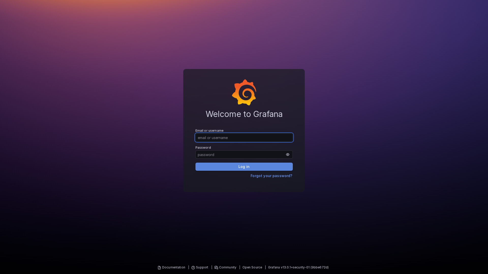
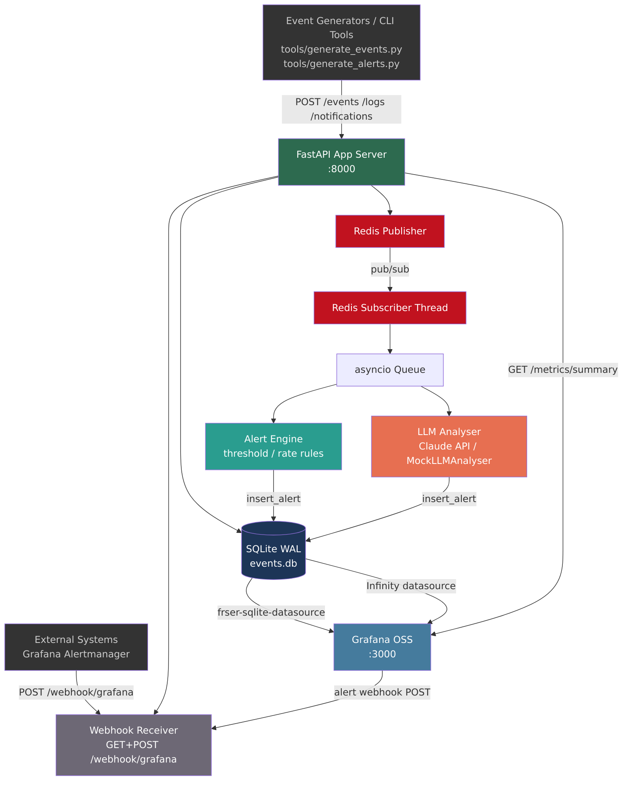
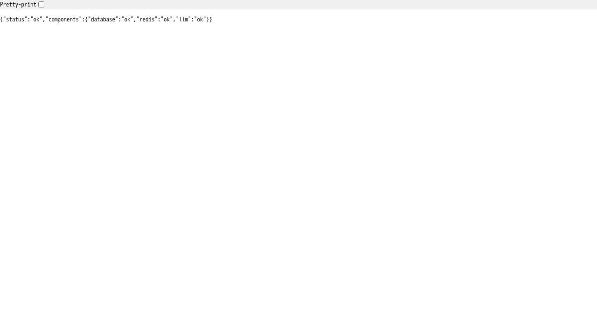
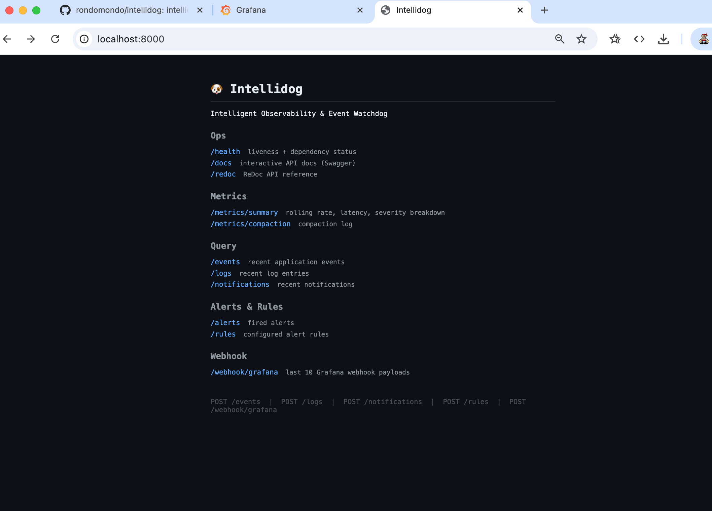
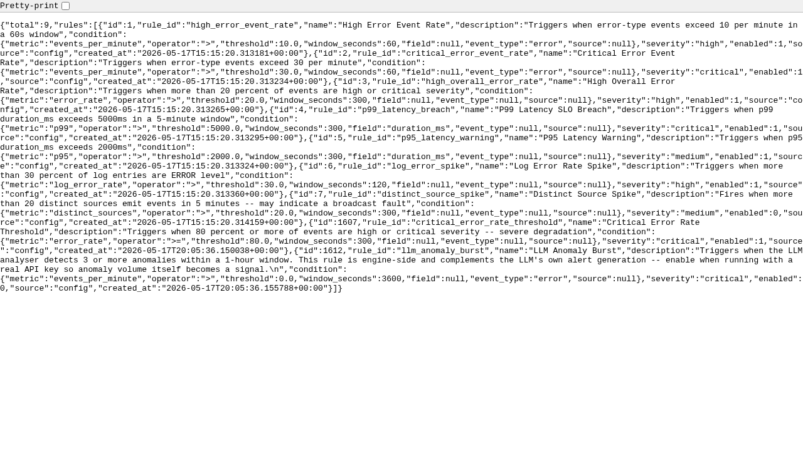
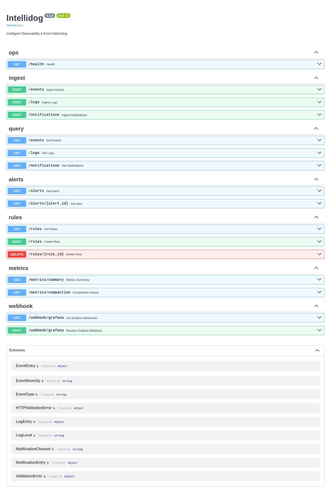
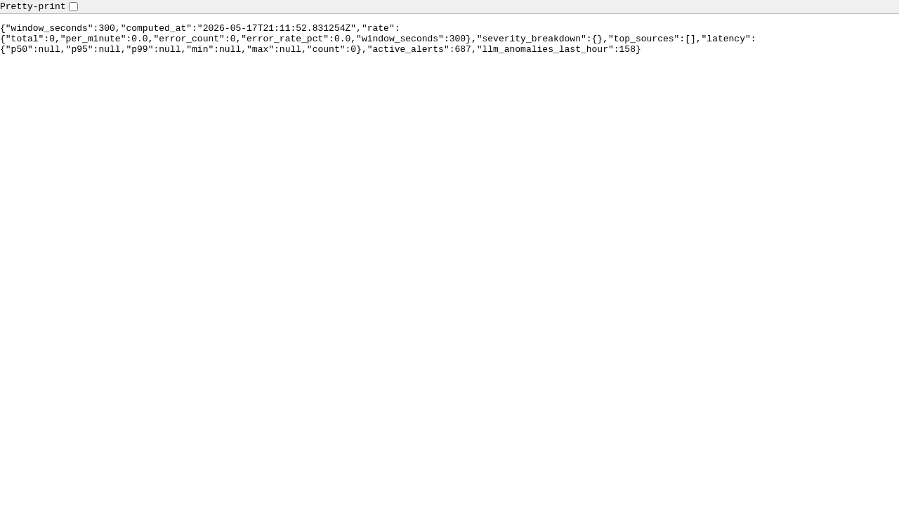
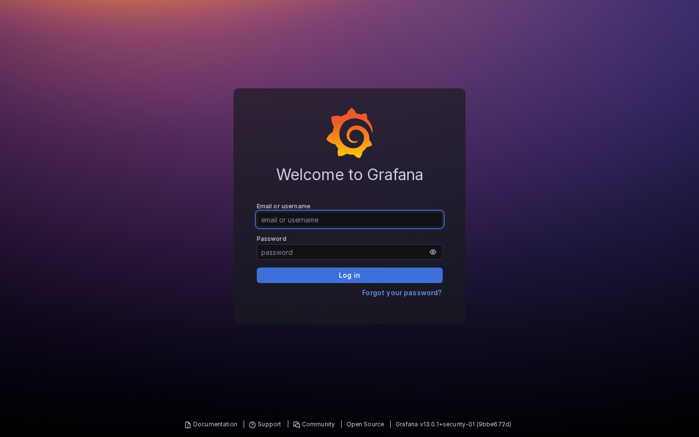
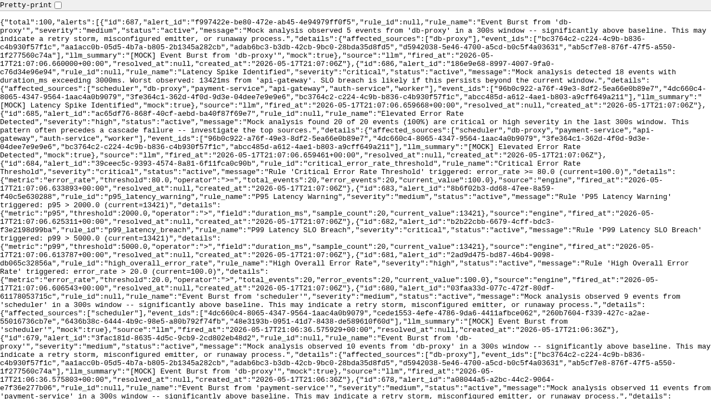

# Intellidog

**Intelligent Observability and Event Watchdog**

Intellidog is a self-hosted event ingestion, alerting, and anomaly-detection service built for SRE and platform teams. It accepts events, logs, and notifications over HTTP; fans them out via Redis pub/sub; evaluates configurable threshold and rate rules; optionally runs Claude LLM analysis on rolling windows; and surfaces everything in a Grafana dashboard -- with a full alert-to-webhook loop included.



> **Slide deck:** [View the Intellidog presentation on Google Slides](https://docs.google.com/presentation/d/1FlBG6_UyHno2dtx56L2yNmGjP_XkPGVIhjdy0l_5emw/edit?usp=sharing) -- or generate a local copy with `make slides`.

---

## The core thesis: LLM anomaly detection vs static rules

This is the point of Intellidog. Static threshold rules are fast and predictable -- but they are blind to anything you did not think to write a rule for. The LLM layer exists to catch what rules miss.

### Out of the box: MockLLMAnalyser

When no Anthropic API key is configured, Intellidog runs `MockLLMAnalyser` automatically. It is fully functional and exercises the entire alert pipeline -- events flow through Redis, the analyser fires, alerts land in SQLite, and Grafana renders them. It uses deterministic heuristics to simulate plausible findings:

- **High error rate** -- flags when more than 40% of events in the window are `critical` or `high` severity
- **Latency spike** -- identifies any event with `duration_ms` above 3000ms and reports the worst offender
- **Source burst** -- detects when a single service emits more than 5 events in the window (retry storm, misconfigured emitter)
- **Ambient anomaly** -- fires a low-probability random finding on quiet traffic to keep the pipeline exercised

This is enough to demonstrate the full system and run all 116 tests in CI without any external dependency.

### With a real Anthropic API key: the difference is stark

When `INTELLIDOG_LLM_API_KEY` is set, the real `LLMAnalyser` takes over. It sends the rolling event window to Claude with a structured prompt and asks for JSON anomaly findings. On the first live run against a 30-event critical spike, Claude returned five findings that no static rule would have caught:

| Severity | Finding |
|----------|---------|
| **critical** | Simultaneous Critical Error Storm Across All Services |
| **critical** | Database Connection Pool Exhausted Across Multiple Services |
| **high** | Payment Gateway Timeouts Propagating Beyond Payment Service |
| **high** | JWT Validation Failures Appearing on Non-Auth Services |
| **medium** | Elevated Response Durations Inconsistent with Reported Errors |

The mock would have flagged "high error rate" and "latency spike" -- correct, but blunt. Claude identified the *causal chain*: DB pool exhaustion driving payment timeouts, which propagated JWT failures to services that shouldn't be affected at all, with latency readings that didn't match the error pattern (a sign of partial degradation, not full outage). These are the cross-service correlation insights that take an on-call engineer several minutes of log-diving to piece together manually.

To enable it:

```bash
echo "INTELLIDOG_LLM_API_KEY=sk-ant-..." > .env
make up
```

The `/health` endpoint confirms the LLM is active:

```json
{
  "status": "ok",
  "components": {
    "database": "ok",
    "redis": "ok",
    "llm": "ok"
  }
}
```

LLM findings appear in `/alerts` with `"source": "llm"` and are visible in the Grafana dashboard alongside rule-based alerts.

---

## Table of contents

1. [Quick start](#quick-start)
2. [Architecture](#architecture)
3. [Components](#components)
4. [Installation](#installation)
5. [Configuration](#configuration)
6. [Alert rules](#alert-rules)
7. [Make targets](#make-targets)
8. [API reference](#api-reference)
9. [Grafana](#grafana)
10. [Testing](#testing)
11. [Examples](#examples)
12. [Reference links](#reference-links)

---

## Quick start

**Requirements:** Docker, Docker Compose, Python 3.12+

```bash
# 1. Clone and enter the project
git clone git@github.com:dkierans/intellidog.git
cd intellidog

# 2. Start all services (API :8000, Grafana :3000, Redis :6379)
make up

# 3. Install local dev tooling (optional -- for generate/query scripts)
make install

# 4. Send synthetic events
make generate

# 5. Trigger an error spike
make generate-spike

# 6. Open the dashboard
open http://localhost:3000   # admin / admin
open http://localhost:8000   # API index
```

Within seconds, events flow through Redis, alert rules fire, and Grafana panels update.

---

## Architecture



**Data flow:**

1. Event producers (your application, CLI tools, Grafana Alertmanager) POST to the FastAPI endpoints.
2. Each accepted event is written to SQLite and published to a Redis channel.
3. A background subscriber thread picks up messages and puts them on an asyncio queue.
4. The **Alert Engine** and **LLM Analyser** consume the queue concurrently and write alerts back to SQLite.
5. Grafana reads SQLite directly (frser-sqlite-datasource) for dashboard panels, and queries `/metrics/summary` via the Infinity datasource for alert evaluation.
6. When Grafana fires an alert it POSTs to `/webhook/grafana`, closing the feedback loop.

---

## Components

### FastAPI app (`src/`)

| Module | Purpose |
|--------|---------|
| `main.py` | App factory, lifespan (startup/shutdown), router registration |
| `api/health.py` | `GET /` HTML index, `GET /health` liveness check |
| `api/ingest.py` | `POST /events`, `POST /logs`, `POST /notifications` |
| `api/query.py` | `GET /events`, `GET /logs`, `GET /notifications` with filters |
| `api/alerts.py` | `GET /alerts` -- fired alert history |
| `api/metrics.py` | `GET /metrics/summary`, `GET /metrics/compaction` |
| `api/webhook.py` | `POST /webhook/grafana` (receive), `GET /webhook/grafana` (last 10) |
| `bus/` | Redis publisher and subscriber thread |
| `engine/` | Alert engine (threshold/rate rules), LLM analyser |
| `db/` | SQLite connection, repository, compaction |
| `models/` | Pydantic schemas for all domain types |
| `config.py` | Pydantic Settings loaded from env vars |

### Redis pub/sub (`bus/`)

Events are published immediately on ingest and consumed by a background thread. The thread puts parsed messages on an asyncio queue, decoupling I/O from evaluation. This means the alert engine and LLM analyser never block ingestion.

### Alert Engine (`engine/alert_engine.py`)

Evaluates every event against loaded YAML rules. Supports:
- **threshold** conditions: `>=`, `<=`, `>`, `<`, `==` on a named metric
- **rate** conditions: percentage of critical events in a rolling time window
- Alerts are deduplicated and stored in SQLite with `severity`, `rule_id`, and `fired_at`.

### LLM Analyser (`engine/llm_analyser.py`)

When `INTELLIDOG_LLM_ENABLED=true` and an API key is set, the analyser periodically sends a rolling window of events to Claude and stores anomaly findings as alerts. In development/test, `MockLLMAnalyser` is used automatically when no key is present.

### SQLite database (`src/db/`)

Single-file WAL-mode SQLite at `data/events.db`. Tables: `events`, `logs`, `notifications`, `alerts`. A scheduled compaction job deletes rows older than `INTELLIDOG_COMPACTION_DAYS` (default 30). WAL autocheckpoint is set to 100 so Grafana's plugin always sees current data.

### Grafana (`grafana/`)

| Component | Detail |
|-----------|--------|
| frser-sqlite-datasource | Direct SQLite reads for all dashboard panels |
| yesoreyeram-infinity-datasource | JSON queries to `/metrics/summary` for server-side alert evaluation |
| Provisioned dashboard | `grafana/provisioning/dashboards/intellidog.json` |
| Provisioned alert rules | Error rate >= 80%, LLM anomaly burst > 10/h |
| Provisioned contact point | Webhook to `http://intellidog:8000/webhook/grafana` |



---

## Installation

### Docker Compose (recommended)

```bash
cp .env.example .env          # create if needed; set INTELLIDOG_LLM_API_KEY
make up                       # builds images, starts all three services
make logs                     # tail logs
make down                     # stop
```

### Local (no Docker)

```bash
# Requires Python 3.12+ and a running Redis instance
make install
export INTELLIDOG_REDIS_URL=redis://localhost:6379/0
make run          # starts uvicorn on :8000 with --reload
```

### Mission control: http://localhost:8000

The API root serves a dark-themed HTML index -- a single-page mission control that lists every GETable route in the system, grouped by function. It is the first place to check after `make up`: if it loads, the API and database are up; if `/health` shows all green, Redis and the LLM are too.



From here you can navigate directly to `/health` for dependency status, `/docs` for the interactive Swagger UI, `/metrics/summary` for live rate and latency data, or any of the query and alert endpoints -- no curl required.

### First-time Grafana login

Navigate to http://localhost:3000 and sign in with `admin` / `admin`. The dashboard and all provisioned resources load automatically.

---

## Configuration

All settings use the `INTELLIDOG_` prefix and can be set in the environment or a `.env` file.

| Variable | Default | Description |
|----------|---------|-------------|
| `INTELLIDOG_ENV` | `development` | Environment name (`development`, `production`) |
| `INTELLIDOG_DB_PATH` | `./data/events.db` | Path to the SQLite database file |
| `INTELLIDOG_REDIS_URL` | `redis://localhost:6379/0` | Redis connection URL |
| `INTELLIDOG_REDIS_CHANNEL` | `intellidog:events` | Redis pub/sub channel |
| `INTELLIDOG_LLM_API_KEY` | _(empty)_ | Anthropic API key -- leave blank to use mock analyser |
| `INTELLIDOG_LLM_MODEL` | `claude-sonnet-4-6` | Claude model for anomaly analysis |
| `INTELLIDOG_LLM_INTERVAL_SECONDS` | `60` | How often the LLM analyses the rolling event window |
| `INTELLIDOG_LLM_ENABLED` | `true` | Set to `false` to disable LLM analysis entirely |
| `INTELLIDOG_COMPACTION_DAYS` | `30` | Delete events/alerts older than this many days |
| `INTELLIDOG_LOG_LEVEL` | `INFO` | Python log level (`DEBUG`, `INFO`, `WARNING`, `ERROR`) |
| `INTELLIDOG_RULES_DIR` | `./rules` | Directory scanned for YAML/JSON alert rule files |
| `INTELLIDOG_HOST` | `0.0.0.0` | Uvicorn bind host |
| `INTELLIDOG_PORT` | `8000` | Uvicorn bind port |

---

## Alert rules

Rules live in YAML or JSON files under `./rules/`. All files in that directory are loaded at startup.

**YAML example:**

```yaml
rules:
  - id: critical_error_rate_threshold
    name: Critical Error Rate Threshold
    condition:
      metric: error_rate
      operator: ">="
      threshold: 80.0
      window_seconds: 300
    severity: critical
    enabled: true

  - id: high_event_rate
    name: High Event Rate
    condition:
      metric: event_count
      operator: ">"
      threshold: 100
      window_seconds: 60
    severity: high
    enabled: true
```

**Supported operators:** `>=`, `<=`, `>`, `<`, `==`

**Supported metrics:** `error_rate`, `event_count`, `critical_count`, `warning_count`, `p95_latency`

The LLM anomaly rule (`rules/llm_anomaly_rule.yaml`) is shipped disabled by default -- enable it when you have an API key configured.



---

## Make targets

```
make help              # show all targets with descriptions
```

### Development

| Target | Description |
|--------|-------------|
| `make install` | Create venv and install all dev dependencies |
| `make run` | Start the API server locally with --reload |
| `make format` | Format code with black + isort |
| `make lint` | Lint with ruff, type-check with mypy |
| `make typecheck` | Run mypy only |
| `make test` | Run full test suite with coverage |
| `make ci` | format + lint + typecheck + test |
| `make clean` | Remove venv, caches, build artefacts |

### Services

| Target | Description |
|--------|-------------|
| `make up` | Build and start API + Redis + Grafana |
| `make down` | Stop and remove all services |
| `make logs` | Tail docker-compose logs |
| `make ps` | Show service status |

### Data generation and testing

| Target | Description |
|--------|-------------|
| `make generate` | POST 20 synthetic events and 10 logs |
| `make generate-spike` | POST 60 critical events (error spike) |
| `make inject-anomaly` | Inject a latency spike anomaly event |
| `make alert-scenario` | Run the full spike alert scenario |
| `make alert-error-rate-80` | Inject exactly 80% critical events to breach the error rate rule |
| `make webhook-test` | POST a simulated Grafana alert webhook |
| `make webhook-resolve` | POST a simulated Grafana resolved webhook |
| `make webhook-show` | Print the last 10 webhook payloads received |
| `make query` | Print the last 20 events from the API |
| `make screenshots` | Capture UI screenshots (services must be running) |

### Infrastructure

| Target | Description |
|--------|-------------|
| `make gen-cert` | Generate self-signed TLS certificates to `certs/` |
| `make docker-build` | Build the devcontainer image |
| `make docker-run` | Run the image interactively |
| `make docker-shell` | Open a bash shell in the devcontainer image |

---

## API reference

Interactive docs are available at http://localhost:8000/docs (Swagger UI) and http://localhost:8000/redoc.



### Endpoints

| Method | Path | Description |
|--------|------|-------------|
| `GET` | `/` | HTML index of all GETable routes |
| `GET` | `/health` | Liveness and dependency status (DB, Redis, LLM) |
| `POST` | `/events` | Ingest an application event |
| `POST` | `/logs` | Ingest a log entry |
| `POST` | `/notifications` | Ingest a notification |
| `GET` | `/events` | Query recent events (filters: severity, source, since) |
| `GET` | `/logs` | Query recent log entries |
| `GET` | `/notifications` | Query recent notifications |
| `GET` | `/alerts` | List fired alerts |
| `GET` | `/rules` | List configured alert rules |
| `POST` | `/rules` | Add a new alert rule |
| `GET` | `/metrics/summary` | Rolling rate, latency, and severity breakdown |
| `GET` | `/metrics/compaction` | Compaction log |
| `POST` | `/webhook/grafana` | Receive a Grafana alert webhook |
| `GET` | `/webhook/grafana` | Return last 10 received Grafana webhook payloads |

### Event payload

```json
{
  "source": "payment-service",
  "severity": "critical",
  "message": "Transaction timeout after 30s",
  "metadata": {"transaction_id": "txn_abc123", "duration_ms": 30042}
}
```

`severity` accepts: `debug`, `info`, `warning`, `error`, `critical`

### Metrics summary response

```json
{
  "rate": {
    "events_per_minute": 14.2,
    "error_rate_pct": 12.5,
    "critical_count_5m": 3
  },
  "latency": {
    "p50_ms": 4.1,
    "p95_ms": 18.7,
    "p99_ms": 42.0
  },
  "severity_breakdown": {
    "critical": 3,
    "error": 5,
    "warning": 8,
    "info": 21,
    "debug": 0
  },
  "llm_anomalies_last_hour": 0
}
```



---

## Grafana

Grafana runs at http://localhost:3000 (admin / admin). All configuration is provisioned automatically -- no manual setup required.

### Dashboard panels

- **Event Rate** -- events per minute over time
- **Error Rate %** -- rolling 5-minute error percentage
- **Severity Breakdown** -- stacked bar by severity level
- **Recent Alerts** -- table of fired alerts with severity and timestamp
- **P95 Latency** -- 95th percentile event processing latency
- **LLM Anomalies** -- anomaly findings from the Claude analyser



### Alert rules (provisioned)

| Rule | Condition | Severity |
|------|-----------|---------|
| High Error Rate | error_rate_pct > 80% (5-min window) | critical |
| LLM Anomaly Burst | llm_anomalies_last_hour > 10 | high |

Both rules route to the **Intellidog Webhook** contact point (`POST /webhook/grafana`), which stores payloads for inspection at `GET /webhook/grafana`.

### Datasources

- **frser-sqlite-datasource** -- mounts `data/events.db` read-only for dashboard panel queries
- **yesoreyeram-infinity-datasource** -- queries `/metrics/summary` JSON API for server-side alert evaluation (required because SQLite datasource cannot run in the alerting evaluator path)

---

## Testing

```bash
make test
# or with verbose output
.venv/bin/pytest tests/ -v
```

The test suite uses `pytest-asyncio`, `pytest-cov`, and in-process FastAPI via `httpx.AsyncClient`. All external dependencies (Redis, SQLite, Anthropic API) are mocked in tests.

**Coverage: 92% across 116 tests (as of v0.0.1)**

```
src/api/health.py          100%
src/api/ingest.py          100%
src/api/metrics.py          97%
src/api/query.py            94%
src/bus/publisher.py       100%
src/bus/subscriber.py       93%
src/db/connection.py       100%
src/db/repository.py        89%
src/engine/alert_engine.py  91%
src/engine/llm_analyser.py  88%
```



---

## Examples

### Send an event

```bash
curl -s -X POST http://localhost:8000/events \
  -H 'Content-Type: application/json' \
  -d '{"source":"payment-service","severity":"critical","message":"Charge failed"}' \
  | python3 -m json.tool
```

### Query events with filters

```bash
curl -s 'http://localhost:8000/events?severity=critical&limit=10' \
  | python3 -m json.tool
```

### Check health

```bash
curl -s http://localhost:8000/health | python3 -m json.tool
# {
#   "status": "ok",
#   "components": {
#     "database": "ok",
#     "redis": "ok",
#     "llm": "disabled"
#   }
# }
```

### Trigger the error rate alert

```bash
make alert-error-rate-80   # posts 80 critical + 20 info events
# Within ~1 minute Grafana fires the alert and POSTs to /webhook/grafana
make webhook-show          # inspect the received payload
```

### Enable LLM analysis

```bash
export INTELLIDOG_LLM_API_KEY=sk-ant-...
export INTELLIDOG_LLM_ENABLED=true
make up
```

Events are batched and sent to Claude every `INTELLIDOG_LLM_INTERVAL_SECONDS` seconds. Anomaly findings appear in the `alerts` table with `source=llm`.

### Simulate a Grafana webhook

```bash
make webhook-test     # POST a firing alert payload
make webhook-resolve  # POST a resolved payload
make webhook-show     # GET last 10 entries
```

---

## Reference links

- [FastAPI](https://fastapi.tiangolo.com/) -- async Python web framework
- [Pydantic v2](https://docs.pydantic.dev/latest/) -- data validation and settings
- [Redis pub/sub](https://redis.io/docs/latest/develop/interact/pubsub/) -- event bus
- [SQLite WAL mode](https://www.sqlite.org/wal.html) -- write-ahead logging for concurrent reads
- [frser-sqlite-datasource](https://grafana.com/grafana/plugins/frser-sqlite-datasource/) -- Grafana SQLite plugin
- [yesoreyeram-infinity-datasource](https://grafana.com/grafana/plugins/yesoreyeram-infinity-datasource/) -- Grafana JSON/API datasource
- [Grafana provisioning](https://grafana.com/docs/grafana/latest/administration/provisioning/) -- declarative resource management
- [Anthropic API](https://docs.anthropic.com/) -- Claude LLM integration
- [Uvicorn](https://www.uvicorn.org/) -- ASGI server
- [APScheduler](https://apscheduler.readthedocs.io/) -- background task scheduling

---

## Licence

MIT
