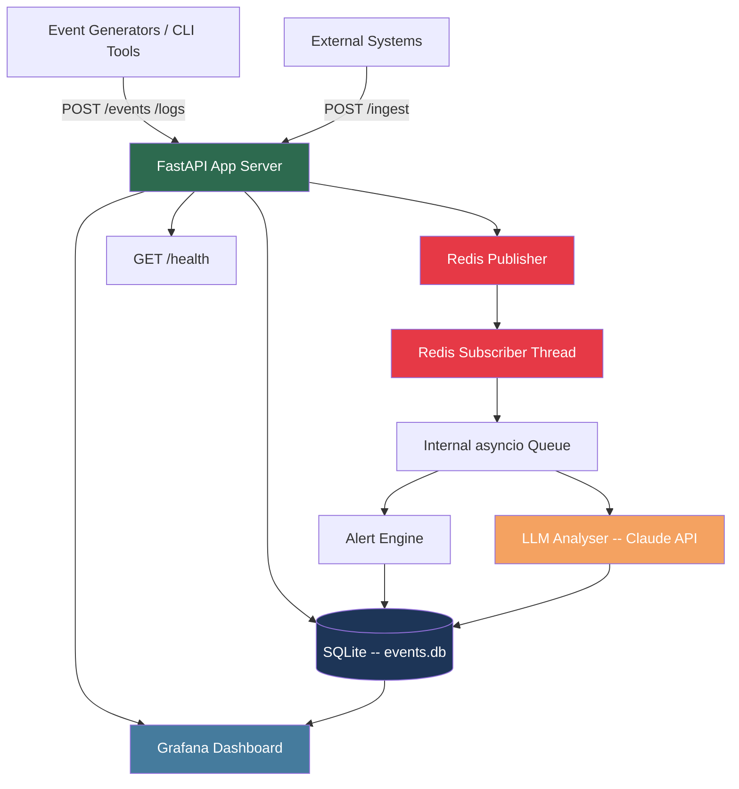

# SPEC.md -- Intellidog: Intelligent Observability & Event Watchdog

**Version:** 0.1.0  
**Status:** Draft -- awaiting confirmation  
**Last updated:** 2026-05-17  
**Timezone:** All times UTC. Timezone-naive datetimes are forbidden.

---

## 1. Objective

Intellidog is an API-first, event-driven observability and watchdog system targeting SRE and AI-engineer
personas inside hypothetical internal or external customer organisations.

**Core problem it solves:** Reduce Mean Time to Detect (MTTD) and Mean Time to Repair (MTTR) by
ingesting structured events and logs, detecting anomalies and threshold breaches with AI assistance,
and surfacing actionable signals via a live dashboard and alert notifications.

**Proof-of-concept scope:** Application and system logs (JSON-structured), async event notifications,
and synthetic generators that simulate realistic traffic for local development and demos.

---

## 2. System Architecture



### Component Summary

| Component | Technology | Role |
|---|---|---|
| API Server | FastAPI (Python 3.12) | Core -- all ingest, query, rule management |
| Database | SQLite (WAL mode) | Persistent event/log/alert storage |
| Message Bus | Redis pub/sub | Real-time event fan-out |
| Alert Engine | Python rules engine | Threshold and rate evaluation |
| LLM Analyser | Claude API (Anthropic) | Anomaly detection, OOB event identification |
| Dashboard | Grafana OSS | Live visualisation |
| Generators | Python CLI scripts | Synthetic event/log simulation |
| Reverse Proxy | nginx (AWS deployment) | TLS termination -- not in local Docker |

---

## 3. Project Structure

```
intellidog/
├── src/
│   ├── __init__.py
│   ├── main.py                  # FastAPI app factory, lifespan hooks
│   ├── config.py                # Settings (pydantic-settings), env vars
│   ├── models/
│   │   ├── __init__.py
│   │   ├── event.py             # Event, LogEntry Pydantic models
│   │   ├── alert.py             # Alert, AlertRule models
│   │   └── metric.py            # MetricSummary models
│   ├── api/
│   │   ├── __init__.py
│   │   ├── ingest.py            # POST /events, POST /logs
│   │   ├── query.py             # GET /events, GET /logs
│   │   ├── alerts.py            # GET/POST /alerts, GET/POST /rules
│   │   ├── metrics.py           # GET /metrics/summary
│   │   └── health.py            # GET /health
│   ├── db/
│   │   ├── __init__.py
│   │   ├── connection.py        # SQLite WAL connection factory
│   │   ├── migrations.py        # Schema creation and migrations
│   │   └── repository.py        # All DB read/write operations
│   ├── engine/
│   │   ├── __init__.py
│   │   ├── alert_engine.py      # Threshold + rate rule evaluation
│   │   ├── llm_analyser.py      # Claude API anomaly detection
│   │   └── compaction.py        # Event compaction strategy
│   ├── bus/
│   │   ├── __init__.py
│   │   ├── publisher.py         # Redis pub/sub publisher
│   │   └── subscriber.py        # Redis subscriber thread + asyncio queue bridge
│   ├── rules/
│   │   ├── __init__.py
│   │   └── loader.py            # Load rules from JSON or YAML files
│   └── dashboard/
│       ├── __init__.py
│       └── grafana.py           # Grafana provisioning helpers
├── tools/
│   ├── generate_events.py       # CLI: simulate app/system log events
│   ├── generate_alerts.py       # CLI: trigger alert scenarios
│   ├── inject_anomaly.py        # CLI: inject OOB / spike events
│   └── query_events.py          # CLI: query and pretty-print events
├── rules/
│   ├── default_rules.yaml       # Default threshold and rate rules
│   └── example_rules.json       # JSON format example
├── grafana/
│   ├── provisioning/
│   │   ├── datasources/
│   │   │   └── sqlite.yaml
│   │   └── dashboards/
│   │       └── intellidog.json  # Pre-built Grafana dashboard
│   └── grafana.ini
├── docker/
│   ├── Dockerfile               # FastAPI app image
│   └── nginx.conf               # nginx template (AWS use)
├── docker-compose.yml           # Local: app + redis + grafana
├── certs/                       # Self-signed certs for local HTTPS
├── scripts/
│   └── gen_cert.py              # Self-signed cert generator (from find4 pattern)
├── tests/
│   ├── __init__.py
│   ├── conftest.py
│   ├── test_ingest.py
│   ├── test_query.py
│   ├── test_alert_engine.py
│   ├── test_llm_analyser.py
│   ├── test_rules_loader.py
│   ├── test_compaction.py
│   └── test_health.py
├── SPEC.md
├── README.md
├── EXAMPLES.md
├── CLAUDE.md
├── .claudeignore
├── .env.example
├── pyproject.toml
├── requirements.txt
├── requirements-dev.txt
├── Makefile
└── prompts.md
```

---

## 4. Event & Log Schema (JSON)

All payloads are JSON. All timestamps are ISO-8601 UTC with timezone offset (`Z` or `+00:00`).

### 4.1 Application Event

```json
{
  "event_id": "uuid4",
  "source": "payment-service",
  "event_type": "error | warning | info | metric | custom",
  "severity": "critical | high | medium | low | info",
  "message": "Payment gateway timeout after 30s",
  "payload": { "order_id": "ord_123", "gateway": "stripe", "duration_ms": 30042 },
  "tags": ["payment", "timeout"],
  "timestamp": "2026-05-17T12:00:00Z"
}
```

### 4.2 System Log Entry

```json
{
  "log_id": "uuid4",
  "host": "web-01",
  "service": "nginx",
  "level": "ERROR | WARN | INFO | DEBUG",
  "message": "upstream timed out (110: Connection timed out)",
  "process": "nginx",
  "pid": 1234,
  "tags": ["nginx", "upstream"],
  "timestamp": "2026-05-17T12:00:01Z"
}
```

### 4.3 Async Notification Event

```json
{
  "notification_id": "uuid4",
  "channel": "slack | webhook | email | pagerduty",
  "source_system": "github | stripe | custom",
  "title": "Deployment failed: main branch",
  "body": "Job ID #998 failed at step 'test'",
  "metadata": {},
  "timestamp": "2026-05-17T12:00:02Z"
}
```

---

## 5. API Endpoints

All responses are JSON. All timestamps UTC.

| Method | Path | Description |
|---|---|---|
| POST | `/events` | Ingest one or a batch of application events |
| POST | `/logs` | Ingest one or a batch of system log entries |
| POST | `/notifications` | Ingest async notification events |
| GET | `/events` | Query events with filters (source, severity, time range, tags) |
| GET | `/logs` | Query logs with filters |
| GET | `/notifications` | Query notifications |
| GET | `/metrics/summary` | Aggregated stats (event rate, error rate, p95/p99 latency) |
| GET | `/alerts` | List all active and resolved alerts |
| GET | `/alerts/{alert_id}` | Get single alert detail |
| GET | `/rules` | List all loaded alert rules |
| POST | `/rules` | Add or update a rule dynamically (JSON or YAML body) |
| DELETE | `/rules/{rule_id}` | Disable a rule (soft delete -- never hard delete) |
| GET | `/health` | Liveness check -- returns DB, Redis, LLM status |

---

## 6. Alert Rules Engine

### 6.1 Rule Schema (YAML example)

```yaml
rules:
  - id: high_error_rate
    name: High Error Rate
    description: Triggers when error events exceed threshold per minute
    condition:
      metric: events_per_minute
      event_type: error
      operator: ">"
      threshold: 10
      window_seconds: 60
    severity: high
    enabled: true

  - id: p99_latency_breach
    name: P99 Latency Breach
    description: Triggers when p99 duration_ms exceeds SLO
    condition:
      metric: p99
      field: payload.duration_ms
      operator: ">"
      threshold: 5000
      window_seconds: 300
    severity: critical
    enabled: true
```

### 6.2 Supported Metrics

- `events_per_minute` -- count of events in rolling window
- `error_rate` -- ratio of error-severity events to total
- `p95`, `p99` -- percentile of a numeric payload field
- `distinct_sources` -- cardinality of source field

### 6.3 Rule Sources

Rules are loaded on startup from `rules/*.yaml` and `rules/*.json`. The `POST /rules` endpoint
allows runtime addition without restart. All rules are persisted to SQLite.

---

## 7. LLM Analyser

Uses the Claude API (Anthropic SDK) to:

1. Identify anomalies in recent event windows that did not breach static thresholds.
2. Classify events as "interesting" vs routine using historical context.
3. Provide a natural-language explanation of any detected anomaly.
4. Run on a configurable interval (default: every 60 seconds) over the last N events.

Results are stored as `alert` records with `source = "llm"` and surfaced in the dashboard.

**Prompt caching** is used on the system prompt to reduce token cost.

---

## 8. Data Retention & Compaction

- Events are **never hard-deleted**.
- After `COMPACTION_DAYS` (default: 30), raw events are summarised into hourly aggregates
  and the originals are marked `compacted = true` (but retained).
- Compaction runs as a background task on startup and then on a daily schedule.
- Grafana queries use both raw and compacted data via SQLite views.

---

## 9. Dashboard (Grafana)

- Grafana runs in Docker alongside the app.
- A pre-provisioned datasource connects to the SQLite file (via `frser/sqlite-datasource` plugin).
- A pre-built dashboard JSON (`grafana/provisioning/dashboards/intellidog.json`) is provisioned on startup.
- **Dashboard panels include:**
  - Event rate over time (time series)
  - Error rate % (gauge)
  - Severity breakdown (pie chart)
  - Active alerts table
  - LLM anomaly feed (table)
  - Top sources by event count (bar chart)
  - P99 latency trend
- **On no-data:** panels show simulated "baseline" data from the last generator run, so the dashboard always looks active. A "Live" badge pulses when real data is flowing.

---

## 10. Docker Compose (Local)

Services:

| Service | Image | Port |
|---|---|---|
| `intellidog` | `./docker/Dockerfile` | `8000` (HTTP), `8443` (HTTPS local) |
| `redis` | `redis:7-alpine` | `6379` |
| `grafana` | `grafana/grafana-oss:latest` | `3000` |

All services have `healthcheck` directives. `intellidog` depends on `redis` being healthy.
Volumes: `./data/events.db` (SQLite), `./grafana/provisioning` (Grafana config).

---

## 11. CLI Tools (tools/)

All tools use `argparse`. All accept `--help`. All write errors to stderr, data to stdout.

| Script | Purpose |
|---|---|
| `generate_events.py` | Simulate N events of configurable type/severity/source. POST to API. |
| `generate_alerts.py` | Trigger alert scenarios (spike, sustained, recovery) via event injection. |
| `inject_anomaly.py` | Inject a single OOB event to test LLM detection. |
| `query_events.py` | Query `/events` with filters and pretty-print results. |

All generators POST to `http://localhost:8000` by default; `--host` flag overrides.

---

## 12. Code Style & Conventions

Per `CLAUDE.md`:

- Python 3.12+, Pydantic v2, FastAPI, `httpx` (async), `argparse` for CLIs
- `ruff` lint/format, `mypy` (strict=false), line length 119
- British spelling throughout
- `snake_case` functions/variables, `PascalCase` classes
- No naive datetimes -- always `datetime.now(UTC)` or `datetime.fromisoformat(...).replace(tzinfo=UTC)`
- `pathlib.Path` throughout, never raw string paths
- `logging` module in library code, never `print` for diagnostics
- Google-style docstrings on all public functions
- No em dashes, ASCII only

---

## 13. Testing Strategy

- Framework: `pytest` with `pytest-cov`
- Target: **90%+ coverage**
- Test types:
  - Unit tests for all engine logic (alert evaluation, compaction, rule loading)
  - Integration tests for all API endpoints (using `httpx.AsyncClient` + `TestClient`)
  - Fixture-based SQLite in-memory DB for all DB tests
  - Mocked Redis for subscriber/publisher tests
  - Mocked Claude API for LLM analyser tests
- CI target: `make ci` (format + lint + typecheck + test)

---

## 14. Boundaries

### Always

- Return JSON from all API endpoints
- Log every ingested event at `DEBUG` level, alerts at `INFO`
- Include `GET /health` reporting DB, Redis, and LLM connectivity
- Auto-start all background threads/tasks on app startup (lifespan hook)
- Use UTC everywhere -- no naive datetimes
- Retain all events permanently (compaction only, never deletion)
- Use prompt caching on LLM calls
- Dashboard must always look active (use seed data if no real events)
- Aim for 90%+ test coverage

### Ask First

- Adding new third-party dependencies
- Changing the SQLite schema after initial creation
- Adding new API endpoints beyond the spec
- Changing the compaction strategy

### Never

- Delete events or rules permanently (soft-disable only)
- Use naive datetimes
- Use `print()` in library/API code
- Use `requests` -- use `httpx` only
- Use raw string paths -- use `pathlib.Path`
- Use bare `except:` without logging and re-raising
- Skip the `--help` flag on any CLI tool
- Store secrets in code -- use environment variables / `.env`

---

## 15. Environment Variables

Defined in `.env.example`, loaded via `pydantic-settings`:

```
INTELLIDOG_ENV=development
INTELLIDOG_DB_PATH=./data/events.db
INTELLIDOG_REDIS_URL=redis://localhost:6379/0
INTELLIDOG_REDIS_CHANNEL=intellidog:events
INTELLIDOG_LLM_API_KEY=sk-ant-...
INTELLIDOG_LLM_MODEL=claude-sonnet-4-6
INTELLIDOG_LLM_INTERVAL_SECONDS=60
INTELLIDOG_COMPACTION_DAYS=30
INTELLIDOG_LOG_LEVEL=INFO
INTELLIDOG_HOST=0.0.0.0
INTELLIDOG_PORT=8000
```

---

## 16. Makefile Targets (additions to scaffold)

| Target | Description |
|---|---|
| `make up` | `docker-compose up --build -d` |
| `make down` | `docker-compose down` |
| `make logs` | `docker-compose logs --follow` |
| `make generate` | Run `tools/generate_events.py` with defaults |
| `make inject-anomaly` | Run `tools/inject_anomaly.py` |
| `make gen-cert` | Generate self-signed certs for local HTTPS |
| `make serve` | Start local HTTPS dev server (port 8443) |

---

## 17. Out of Scope (this iteration)

- Authentication / API keys (planned for AWS deployment phase)
- nginx TLS termination (AWS phase)
- GitHub Actions CI pipeline (AWS phase)
- Multi-tenancy
- Agent/tool use by the LLM (read-only analysis only in v0.1)
