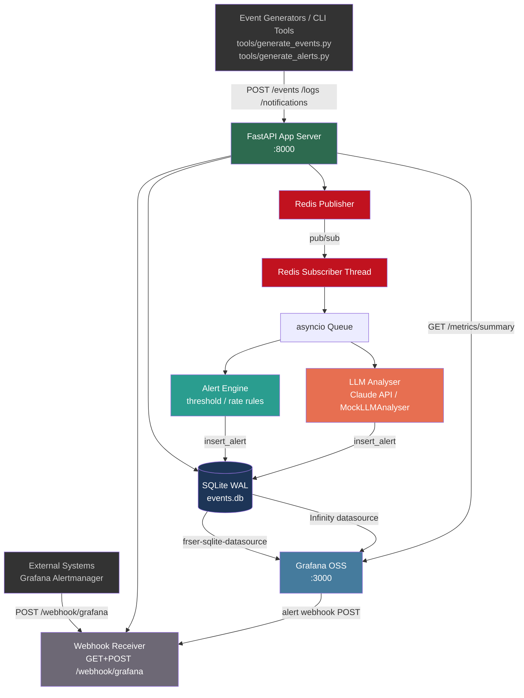

# Architecture

```mermaid
graph TD
    GEN["Event Generators / CLI Tools<br/>tools/generate_events.py<br/>tools/generate_alerts.py"] -->|POST /events /logs /notifications| API

    EXT["External Systems<br/>Grafana Alertmanager"] -->|POST /webhook/grafana| WH

    API["FastAPI App Server<br/>:8000"] --> DB
    API --> PUB
    API --> WH["Webhook Receiver<br/>GET+POST /webhook/grafana"]

    PUB["Redis Publisher"] -->|pub/sub| SUB["Redis Subscriber Thread"]
    SUB --> Q["asyncio Queue"]
    Q --> AE["Alert Engine<br/>threshold / rate rules"]
    Q --> LLM["LLM Analyser<br/>Claude API / MockLLMAnalyser"]

    AE -->|insert_alert| DB[("SQLite WAL<br/>events.db")]
    LLM -->|insert_alert| DB

    DB -->|frser-sqlite-datasource| GR["Grafana OSS<br/>:3000"]
    DB -->|Infinity datasource| GR
    API -->|GET /metrics/summary| GR

    GR -->|alert webhook POST| WH

    style API fill:#2d6a4f,color:#fff
    style DB fill:#1d3557,color:#fff
    style PUB fill:#c1121f,color:#fff
    style SUB fill:#c1121f,color:#fff
    style GR fill:#457b9d,color:#fff
    style LLM fill:#e76f51,color:#fff
    style AE fill:#2a9d8f,color:#fff
    style WH fill:#6d6875,color:#fff
    style GEN fill:#333,color:#ccc
    style EXT fill:#333,color:#ccc
```
